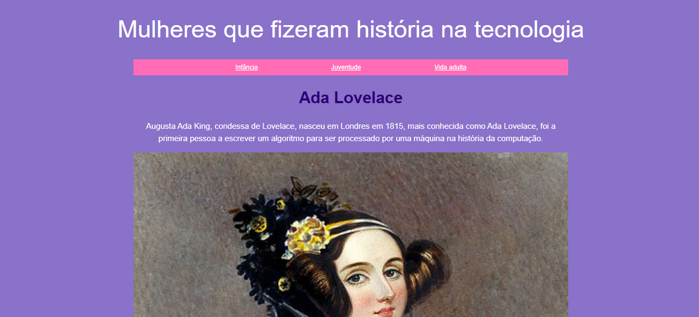

🌐 Minha Primeira Página Web: Fundamentos de Front-End
Este foi o meu projeto de introdução ao desenvolvimento web, realizado durante o curso da PrograMaria. O objetivo foi construir uma página do zero, aplicando os pilares fundamentais da web para criar uma interface funcional e bem estruturada.

🛠️ O que este projeto demonstra:
Estruturação Semântica: Uso correto de tags HTML5 para garantir acessibilidade e uma boa indexação (SEO).

Estilização com CSS3: Aplicação de seletores, cores, fontes e box-model para dar identidade visual ao projeto.

Lógica de Layout: Entendimento de como os elementos se comportam na página e como organizar o conteúdo de forma hierárquica.

Primeiros Passos em Versionamento: Uso do Git para controlar as etapas do desenvolvimento.

📂 Tecnologias Utilizadas:
HTML5: Estrutura e conteúdo.

CSS3: Design e estilo.

Git/GitHub: Versionamento de código.

🧠 Visão de Engenharia:
Para quem hoje foca em Dados, este projeto foi essencial para entender como as informações são exibidas e capturadas na ponta final (o usuário). Conhecer a estrutura do DOM e do HTML é o que me permite, por exemplo, realizar Web Scraping de forma eficiente e entender a origem dos dados que trafegam na web.

📸 Visual do Projeto:

